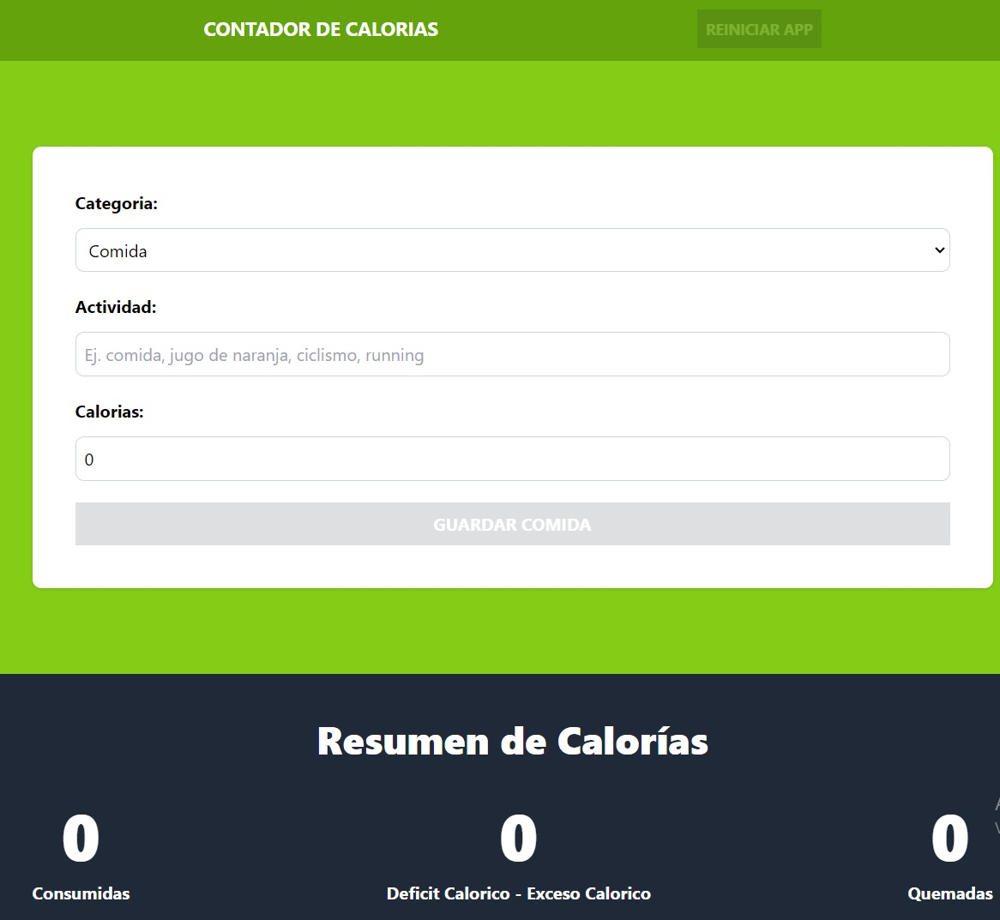
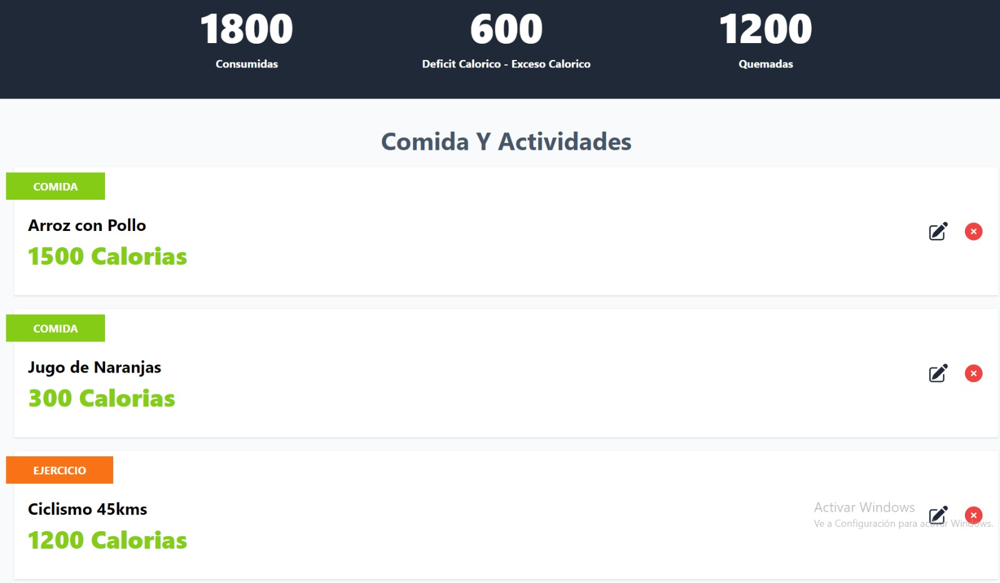

# Contador de Calorías

Este es un proyecto para rastrear la ingesta de calorías y las actividades diarias, desarrollado con React, TypeScript, Tailwind CSS y Vite.

## Descripción

El **Contador de Calorías** permite a los usuarios agregar y visualizar actividades diarias junto con el consumo de calorías. La aplicación está diseñada para ayudar a los usuarios a gestionar su dieta y actividad física de manera sencilla y eficiente.

## Funcionalidades

1. **Agregar Actividades**: Los usuarios pueden agregar nuevas actividades especificando el nombre, la categoría y la cantidad de calorías quemadas.
2. **Visualización de Actividades**: Se muestra una lista de actividades agregadas con detalles sobre las calorías quemadas.
3. **Total de Calorías**: Se muestra un resumen del total de calorías quemadas.
4. **Persistencia de Datos**: Los datos de las actividades se almacenan en `localStorage` para su persistencia entre sesiones.
5. **Reducción de Estado**: Se utiliza `useReducer` para manejar el estado de las actividades de manera eficiente.
6. **Referencia de Elementos**: Uso de `useRef` para manejar referencias a elementos del DOM, mejorando la interacción del usuario.

## Instalación

Sigue estos pasos para configurar el proyecto localmente:

1. Clona el repositorio:

   ```sh
   git clone <https://github.com/Mati69lbt/calcular_Calorias>
   ```

2. Navega al directorio del proyecto:

   ```sh
   cd contador-calorias
   ```

3. Instala las dependencias:

   ```sh
   npm install
   ```

4. Inicia el servidor de desarrollo:
   ```sh
   npm run dev
   ```

## Scripts Disponibles

- `dev`: Inicia el servidor de desarrollo usando Vite.
- `build`: Compila el proyecto.
- `lint`: Ejecuta ESLint para analizar el código.
- `preview`: Previsualiza el proyecto compilado.

## Dependencias

- `react`: ^18.2.0
- `react-dom`: ^18.2.0
- `uuid`: ^9.0.1

## DevDependencies

- `@types/react`: ^18.2.66
- `@types/react-dom`: ^18.2.22
- `@typescript-eslint/eslint-plugin`: ^7.2.0
- `@typescript-eslint/parser`: ^7.2.0
- `@vitejs/plugin-react-swc`: ^3.5.0
- `autoprefixer`: ^10.4.19
- `eslint`: ^8.57.0
- `eslint-plugin-react-hooks`: ^4.6.0
- `eslint-plugin-react-refresh`: ^0.4.6
- `postcss`: ^8.4.38
- `tailwindcss`: ^3.4.3
- `typescript`: ^5.2.2
- `vite`: ^5.2.0

## Capturas de Pantalla

### Página Principal



### Lista de Actividades



## Despliegue

_Agrega aquí el enlace al despliegue de tu aplicación si la has desplegado en algún servicio como Vercel, Netlify, etc._

## Uso de useRef

La función `useRef` se agregó para manejar referencias a elementos del DOM, permitiendo una mejor gestión de los formularios y otros elementos interactivos en la aplicación.

## Uso de useReducer y localStorage

Se utilizó `useReducer` para manejar el estado de las actividades de manera más estructurada y eficiente. Los datos de las actividades se guardan en `localStorage`, permitiendo que los usuarios no pierdan su información al cerrar el navegador o recargar la página.

## Archivos Principales

### App.tsx

Contiene la estructura principal de la aplicación y el manejo de rutas.

### CalorieTracker.tsx

Componente principal que gestiona la lógica de seguimiento de calorías.

### Form.tsx

Formulario para agregar nuevas actividades.

### ActivityList.tsx

Lista de actividades que muestra todas las actividades agregadas por el usuario.

### CaloriDisplay.tsx

Componente que muestra el total de calorías quemadas.

### activity-reducer.ts

Define el `reducer` para manejar las acciones relacionadas con las actividades.

### categories.ts

Define las categorías disponibles para las actividades.

### index.ts

Punto de entrada de la aplicación.

## Autor

Matías Daniel Delgado
